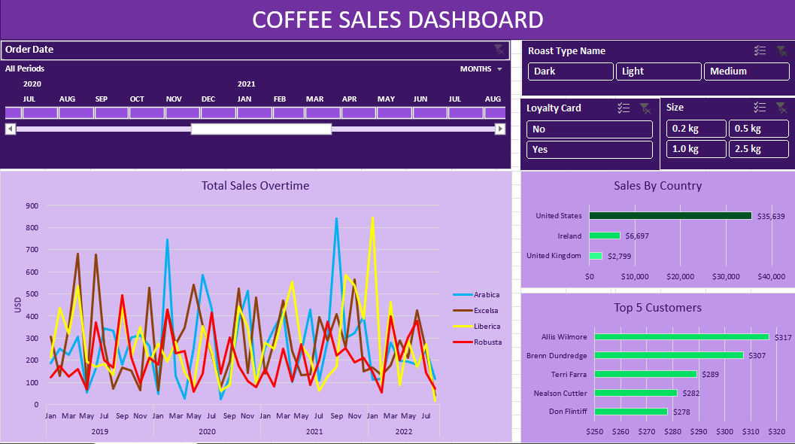

# Coffee Sales Dashboard

## Overview

This Excel dashboard provides an insightful visualization of coffee sales data. It enables easy analysis of key metrics through various charts and interactive elements.

## Features

- **Line Chart of Total Sales Over Time**: Visualize the trend of coffee sales across different periods.
- **Sales Timeline**: Track sales over specific time frames to identify patterns and anomalies.
- **Slicers**:
  - **Roast Type**: Filter sales data based on different roast types.
  - **Loyalty Card**: Analyze the impact of loyalty card holders on overall sales.
  - **Size**: Focus on sales for specific coffee sizes.
- **Bar Charts**:
  - **Sales by Country**: Compare sales performance across different countries.
  - **Top 5 Customers**: Identify and analyze the top customers contributing to sales.

## Data Processing

- **Functions Used**:
  - **XLOOKUP**: To efficiently find and return values from a range.
  - **IF ELSE**: For conditional data manipulation.
  - **INDEX MATCH**: To perform advanced lookups and data retrieval.

These functions were instrumental in populating and organizing the data that drives the dashboard.

## How to Use

1. **Open the Dashboard**: Load the Excel file to access the dashboard.
2. **Interact with Slicers**: Use the slicers to filter and drill down into specific aspects of the data.
3. **Analyze the Charts**: Review the line and bar charts for an overview of sales trends, performance by country, and top customers.

## Preview

## Additional Information

- **Data Source**: The dashboard is built using historical coffee sales data.
- **Interactivity**: All charts are linked to the slicers for dynamic filtering.

